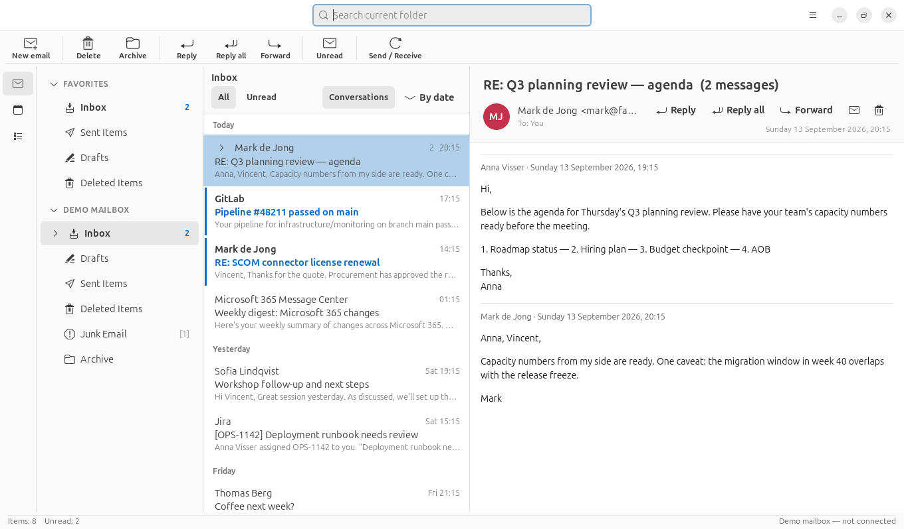

# OpenLook

An Outlook-style **native** mail client for Ubuntu (and other Linux distros),
written in Rust with GTK4 + libadwaita — the same toolkit as Ubuntu's own
GNOME apps. It connects to a Microsoft 365 mailbox through the Microsoft
Graph API and keeps a local copy so mail is readable **offline**.



## Features

- Classic Outlook three-pane layout: folder pane, message list, reading pane,
  with draggable dividers whose widths are remembered, a ribbon-style
  command bar and a status bar
- **HubSpot tickets** in their own pane beside Mail and Calendar: pipeline
  stages as folders, tickets as rows, and a ticket's threads assembled in
  the reading pane
- **Several mailboxes at once** — each gets its own section in the folder
  pane, its own cache and its own sync, with a shared Favorites section on top
- Message list grouped by date (Today / Yesterday / weekday / Last Week), an
  All / Unread filter and a date sort toggle
- Reading pane with contact initials, Reply, Reply all and Forward
- Drag a message onto a folder to move it (within the same mailbox)
- **Calendar**: a month view switched from the rail on the left, merging
  every mailbox's events (colour-coded), with a day panel showing times,
  location and organiser; double-click an appointment to open it. Cached
  like mail, so it reads offline
- **Works offline**: mail is cached in SQLite and message bodies are
  prefetched, so the app opens instantly and stays readable with no network
- **Changes made offline are queued** — read/unread, delete and messages you
  write are applied locally at once and pushed to the server when you
  reconnect (they survive quitting the app)
- Incremental sync using Graph delta queries — the first enumeration is
  bounded to a recent window so a token arrives in one request, after which
  each poll is a single cheap call; local edits are never clobbered by a
  stale sync
- Read HTML mail (WebKitGTK, JavaScript disabled; links open in your browser)
- Compose, send, reply; mark read/unread; delete; per-folder search
- **Demo mailbox** out of the box, so the whole UI works before you sign in
- Microsoft 365 sign-in with **no app registration needed** (see below);
  tokens are cached in `~/.config/openlook/` (0600) and refreshed silently

## Requirements

A GTK4 desktop and Rust. Ubuntu 22.04 is the oldest supported release: it has
everything at runtime (GTK 4.6, libadwaita 1.1, and WebKitGTK 6.0 from
jammy-updates), as does anything newer.

```bash
# Rust, if you don't have it
curl --proto '=https' --tlsv1.2 -sSf https://sh.rustup.rs | sh

# Recommended: the GTK development files (needs root)
sudo apt install libgtk-4-dev libadwaita-1-dev libwebkitgtk-6.0-dev libgraphene-1.0-dev
```

If you can't install those `-dev` packages, the build falls back to
`tools/dev-shim.sh`, which generates pkg-config metadata and linker symlinks
for the GTK/WebKit libraries already installed on the system. The resulting
binary is completely normal — the shim only affects build time.

## Build, run, install

```bash
cargo run                 # run from the repo
cargo test                # offline-behaviour tests (no display needed)
./install.sh              # build release + install launcher and icon

./tools/mkdeb.sh                  # .deb for this machine
./tools/mkdeb.sh --target jammy   # .deb for Ubuntu 22.04, from any newer host
```

`install.sh` sources the shim automatically when the `-dev` packages are
missing.

## Signing in

OpenLook holds any number of mailboxes. Add the first one when it asks on
first start, and further ones from the menu → **Add mailbox…**; each appears
as its own section in the folder pane and syncs independently. Menu →
**Remove this mailbox** drops the one whose folder is selected.

On first start OpenLook asks you to add your account, like Outlook does.
Click **Sign in**, enter the short code in your browser, and log in as usual —
your password and two-factor prompt stay with Microsoft. You can also skip and
use the demo mailbox.

**No Azure app registration is required.** OpenLook signs in as Microsoft's
public "Microsoft Graph Command Line Tools" application
(`14d82eec-204b-4c2f-b7e8-296a70dab67e`), the same public client Microsoft's
own Graph PowerShell uses, requesting delegated `User.Read`, `Mail.ReadWrite`
`Mail.Send` and `Calendars.Read` scopes. The first sign-in shows a consent prompt for those
permissions.

If your organization blocks that app, register your own (2 minutes) and paste
its client ID under **Advanced** in the sign-in dialog, or in Settings:

1. <https://portal.azure.com> → Microsoft Entra ID → **App registrations** →
   **New registration**. No redirect URI needed.
2. **Authentication** → **Allow public client flows** → **Yes** → Save.
3. **API permissions** → Microsoft Graph → Delegated: `User.Read`,
   `Mail.ReadWrite`, `Mail.Send`, `Calendars.Read` (grant admin consent if
   required).

## How offline works

The UI never talks to the network. It reads only from the local database,
and a background engine reconciles that database with the server:

```
  UI  ──reads──>  SQLite cache  <──writes──  sync engine  <──HTTPS──>  Graph
   └──actions────────┘  (applied at once)         └── outbox replayed when online
```

- **Reading**: folders, message lists and prefetched bodies come from
  `~/.local/share/openlook/<account>.db`. With no network you still see
  everything that has been synced; a message whose body was never downloaded
  says so instead of failing.
- **Writing**: every change is applied to the cache immediately, then queued
  in an `outbox` table. The engine drains that queue whenever it can reach
  the server, and retries what it can't. A message composed offline appears
  in Sent Items marked *Queued* until it goes out.
- **Safety**: messages with queued changes are skipped when a sync would
  otherwise overwrite them, so a sync in flight can't undo what you just did.
- The header bar shows the state: *Syncing…*, *Offline — showing cached
  mail*, *N waiting to sync*, or *Updated 5 min ago*.

## Layout

```
src/
  model.rs      shared types
  db.rs         SQLite cache + outbox (the offline core)
  sync.rs       background engine: delta sync, body prefetch, queue replay
  graph.rs      Microsoft Graph client, with errors classified for retry
  auth.rs       device-code OAuth + token cache
  demo.rs       demo mailbox seeded into the cache
  ui/           window, compose, dialogs
tests/offline.rs  offline behaviour tests
tools/dev-shim.sh build without the GTK -dev packages
```

## Roadmap

- Creating and editing appointments (the calendar is read-only today)
- Attachments (view/save/send)
- Full-text search across folders (the cache makes this cheap)
- New-mail desktop notifications
